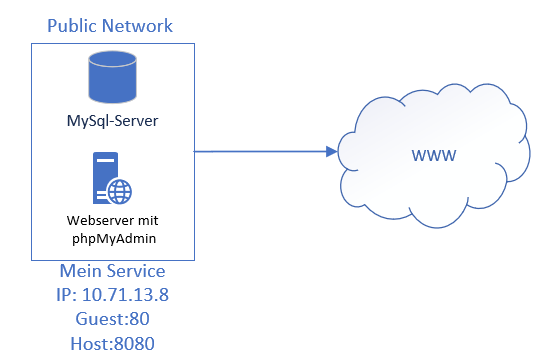

# Modul 300 - Leistungsbeurteilung 1

## Inhaltsverzeichnis
- [Modul 300 - Leistungsbeurteilung 1](#modul-300---leistungsbeurteilung-1)
  - [Inhaltsverzeichnis](#inhaltsverzeichnis)
  - [Aufgabenstellung](#aufgabenstellung)
  - [Voraussetzungen/WichtigeThemen](#voraussetzungenwichtigethemen)
  - [Netzwerkplan](#netzwerkplan)
  - [Mein Service](#mein-service)
  - [Sicherheitsaspekte](#sicherheitsaspekte)
  - [Testing](#testing)
  - [Wissenszuwachs](#wissenszuwachs)
  - [Reflexion](#reflexion)
  - [Glossar](#glossar)

## Aufgabenstellung

Die LB1 besteht darin, ein Service zur Verfügung zu stellen. Dieser Service sollte mit dem starten eines Vagrantfiles ohne weitere Konfigurationen starten. Das ganze sollte anschliessend mit Markdown dokumentiert werden. Die Bewertungskriterien findet man [hier](https://bscw.tbz.ch/bscw/bscw.cgi/d29084554/M300_LB1_Bewertungsraster.pdf?op=get&open=1).

## Voraussetzungen/WichtigeThemen
Damit der Service erstellt werden kann, müssen vorerst einige Dinge noch erledigt werden:

**GitHub Account** 
GitHub dient sozusagen als Cloud-Speicher unserer Dateien und Dokumentationen.

**ssh Keys** 
Die ssh schlüssel ermöglichen uns, eine verschlüsselte Netzwerkverbindung aufzubauen.

**Git Client** 
Um unsere Dateien von GitHub auf unseren lokalen Comupter zu holen, benötigen wir Git client. Unter Windows nennt sich das Git/Bash.

**VirtualBox** 
Zueinem benötigen wir einen Hypervisor, welcher unsere VMs erstellt. In unserem Fall benutzen wir VirtualBox, da bei Vagrant Boxes dieser Hypervisor überall unterstützt wird.

**Vagrant** 
Damit unser Client überhaupt Vagrant versteht, muss Vagrant von ihrer Webseite heruntergeladen werden.

**Visual Studio Code** 
Alle lokalen Repositories an einem Ort zu verwalten und die dazugehörigen Dateien zu bearbeiten ermöglicht uns Visual Studio Code. Stduio Code kann man sich ganz einfach von ihrer Webseite herunterladen.

**Linux**  
Linux ist der Kernel eines Betriebssystems. Linux ist für unterschiedliche Hardware verfügbar und ist Multiuser und Multitasking fähig.

**Virtualisierung**  
 Anstelle einer hardwarebasierten Komponente eine softwarebasierte Komponente erstellt.

 **Versionsverwaltung**  
System zur erfassung von Änderungen an Dokumenten oder Dateien verwendet wird.

Die genaue Anleitung für die installationen:
[Kapitel 20](https://github.com/mc-b/M300/blob/master/10-Toolumgebung/README.md)

## Netzwerkplan

        

## Mein Service

Bei meinem Service wird ein Webserver erstellt. Auf dem Webserver läuft die Webanwendung phpMyadmin, welches mit dem sql-Server verbunden ist.

**Zugriff auf den Service**  
Man muss in einem Browser http://10.71.13.8:80/phpmyadmin eingeben.

**Das Vagrantfile**  
Installation vom Webserver und php
~~~~ 
sudo apt-get -y install apache2
  sudo apt-get -y install php libapache2-mod-php
~~~~
Debconf instllatieren. Ist notwendig für Prompt anfragen
~~~~ 
sudo apt-get install -y debconf-utils
~~~~
Die ersten zwei Befehle sind Promptbefehle. Anschliessend wird der Mysql-Server installiert
~~~~ 
sudo debconf-set-selections <<< 'mysql-server mysql-server/root_password password asdf123'   
sudo debconf-set-selections <<< 'mysql-server mysql-server/root_password_again password asdf123'
sudo apt-get -y install mysql-server
~~~~
Hier geben wir die Promptbefehle für phpMyAdmin ein und laden anschliessend phpMyAdmin herunter.
~~~~ 
debconf-set-selections <<< "phpmyadmin phpmyadmin/dbconfig-install boolean true"
debconf-set-selections <<< "phpmyadmin phpmyadmin/app-password-confirm password asdf123"
debconf-set-selections <<< "phpmyadmin phpmyadmin/mysql/admin-pass password asdf123"
debconf-set-selections <<< "phpmyadmin phpmyadmin/mysql/app-pass password asdf123"
debconf-set-selections <<< "phpmyadmin phpmyadmin/reconfigure-webserver multiselect apache2"
sudo apt-get -y install phpmyadmin     
~~~~
Wir müssen die FireWall erlauben. Anschliessend können wir FireWall Regeln hinzufügen.
~~~~ 
sudo ufw -f enable
sudo ufw allow 22/tcp
sudo ufw allow 80/tcp
sudo ufw allow 8080/tcp
~~~~
Zum Schluss erstellen wir einen User ohne Rechte
~~~~ 
adduser test
echo 'view:pass' | chpasswd
~~~~

## Sicherheitsaspekte

Um die Sicherheit unseres Services zu schützen, werden in unser Vagrantfile diese drei Sachen hinzugefügt: 
* Benutzer mit Rechtevergabe
* Firewall
* Reverse Proxy 
Durch die entsprechenden Rechtevergabe können unbefugte Benutzer nicht Dinge machen, die eigentlich nicht für sie Gedacht wären. Mit der Firewall können wir entsprechende Ports öffnen und schliessen. Nur Ports, welche für den Service benötigt sind, sollten offen sein. 

## Testing

| Testfall                                                                                               | Resultat                                                                                                                                |
|--------------------------------------------------------------------------------------------------------|-----------------------------------------------------------------------------------------------------------------------------------------|
| Vom Client auf http://localhost:80 zugreifen.                                                                 | Funktioniert. Die Default Page des Webservers wird angezeigt.                                                        |
| Vom Client auf http://localhost:80/phpmyadmin                                           | Funktioniert. Phpmyadmin Startseite wird angezeigt.                                     |
| git clone                                                                                              | Funktioniert einwandfrei                                                        |
| FireWall Status überprüfen                                                                                            | FireWall is running                                                        |

  

## Wissenszuwachs
Im Geschäft habe ich Mal mit git gearbeitet. Alles andere musste ich neu dazulernen. Ich weiss jetzt wie Vagrant funktioniert, wie man es Konfigurieren muss und nötigen Befehle dazu. Hier eine übersicht von vorher und jetzt:  
Vorher: Wie vorhin erwähnt war ich ein halbes Jahr im Unix Team. Gegen Ender der Unix Stage konnte ich mit Git arbeiten. Somit verstand ich ungefähr am Anfang schon etwas.  
Jetzt: Jetzt verstehe ich viel besser, was die Absicht von Git ist und was es alles für Vorteile bringt. Das erstellen von VMs geht mit Vagrant so schnell und einfach. Icv bin in der Lage, ein Vagrantfile zu erstellen und zu konfigurieren. Zudem kann ich mit Markdown dokumentieren.

| Command           | Beschreibung                                                                                                                                                                                                                                                                              |
| ----------------- | ----------------------------------------------------------------------------------------------------------------------------------------------------------------------------------------------------------------------------------------------------------------------------------------- |
| vagrant up        | Startet virtuelle Maschine                                                                                                                                                                                                                                                                    |
| vagrant halt      | Stoppt virtuelle Maschine                                                                                                                                                                                                                                                                     |
| vagrant destroy   | Zerstört die virtuelle Maschine. Der Source Code und der Inhalt des Data-Verzeichnisses bleiben unverändert. Nur die VirtualBox Maschinen-Instanz wird zerstört. |
| vagrant provision | Neukonfiguration der virtuellen Maschine nach einer Source Code Änderung.                                                                                                                                                                                                                               |
| vagrant reload    | Neuladen der virtuellen Maschine. Nützlich, wenn man die Einstellungen zu dem Netzwerk oder einen synchronisierten Ordner ändern will.                                                                                                                                                                                             |

## Reflexion
Bis jetzt konnte ich vieles neues lernen. Leider habe ich es nicht geschafft, mein Service auf zwei Server aufzuteilen. Insgesamt war es aber keine leichte arbeit. Am schwierigsten war es, die Prompt Befehle, welche bei einer Installation auftreten, zu bestätigen. Das ganze Projekt habe ich alleine ohne hilfe gemacht. Schlussendlich wurden viele Stunden dafür geopfert, jedoch wurde vieles dazugelernt.

## Glossar

Vagrant: Mit Vagrant kann man virtuelle Maschinen erstellen und verwalten.

Markdown: Ist eine vereinfachte Auszeichnungssprache.

Apache2: Ist ein Webserver.

phpMyAdmin: Freie Webanwendung zur Administration von MySQL-Datenbanken/MariaDB

SQL-Server: Datenbank mit der Sprache sql
